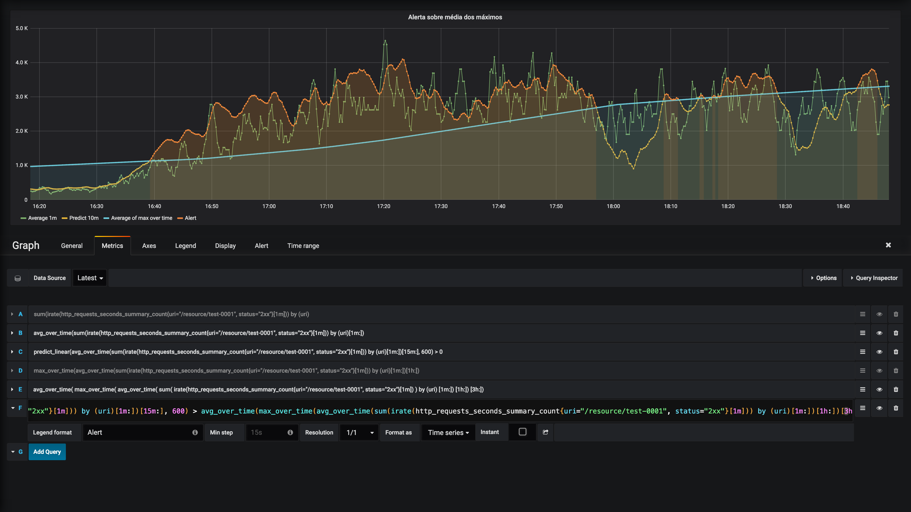

Prometheus
==========

Prometheus é um sistema open-source de monitoramento e alerta. Este sistema coleta métricas e processa regras, armazenando-os em um banco de dados de série temporal (_time series database_ **tsdb**).


Tipos de Métrica
----------------

Os tipos de métrica foram explicados na sessão anterior **[1\_metrics]**.


Configurações
-------------

Para o Prometheus fazer o _scrape_ de um alvo, é preciso configurá-lo um pouco<sup>[configuration](https://prometheus.io/docs/prometheus/latest/configuration/configuration/)</sup>. É preciso dizer o endereço do alvo, se o esquema é http ou https, de quanto em quanto tempo é para ser feito a coleta, qual o tempo que ele pode gastar processando as regras, quanto tempo pode ficar fazendo o _scrape_ de um único alvo, e assim por diante. Essa configuração é definida pelo arquivo **prometheus.yml**. Os parâmetros são passados através do **docker-compose.yml** e o **startup.sh** constroi o arquivo de configuração. Eis um exemplo do arquivo:
**prometheus.yml**
```
global:
  scrape_interval: 30s
  evaluation_interval: 15s
  scrape_timeout: 10s

rule_files: 
  - aggr_global_http_per_server.yml

scrape_configs:
  - job_name: 'prometheus'
    static_configs:
    - targets: ['localhost:9090']

  - job_name: "metrics_generator/metrics"
    metrics_path: /metrics
    file_sd_configs:
      - files:
        - targets.json
```

A seção `global` define as configurações que serão usadas para todos os `jobs`. O `scrape_interval` define de quanto em quanto tempo o Prometheus vai coletar as métricas nos alvos (este intervalo de tempo independe do tempo que levou para fazer a coleta<sup>[prometheus-ticker](https://utcc.utoronto.ca/~cks/space/blog/sysadmin/PrometheusScrapeIntervalBit)</sup>). O `evaluation_interval` é o tempo que o Prometheus tem para processar as regras definidas nos arquivos de regras. O `scrape_timeout` limita o tempo que o Prometheus pode fazer a coleta, por alvo. A seção seguinte é a `rule_files` no qual possui uma lista de arquivos de regras. Cada arquivo `yml` embaixo possui o nome do grupo das regras, o nome da regra e a expressão para processar antes de armazenar no tsdb.

Na seção `scrape_configs` estão definidas os alvos para coletar as métricas. Para cada alvo, é preciso um nome, um caminho de métricas (_endpoint_), e um arquivo com a lista dos alvos (pode ser um `dns:porta` ou `ip:porta`). No caso deste exemplo, como está sendo usado o `docker-compose` para executar os serviços, o alvo no `targets.json` pode ser com o nome do serviço (`gerador:3000`) pois o docker resolve o nome e encontra seu endereço.


Regras e sinais para monitoração
-----------------------

As regras de gravação são definidas de acordo com a estrutura definida no site do prometheus<sup>[rules](https://prometheus.io/docs/prometheus/latest/configuration/recording_rules/)</sup>, tendo o nome do grupo de métricas, o nome da regra, e a expressão para ser processada. As métricas que são definidas neste exemplo seguiram três dos quatros sinais de monitoração de acordo com o livro [Site Reliability Engineering](https://landing.google.com/sre/sre-book/chapters/monitoring-distributed-systems/#xref_monitoring_golden-signals), escrito por engenheiros da Google. Os quatro sinais de ouro da monitoração são: **latência**, que é o tempo de resposta do serviço; **tráfego**, que é a medida da demanda do sistema, como quantidade de requisições http por segundo; **erros**, que representa a taxa de erro do serviço e; **saturação**, que indica quão "cheio" está o sistema.


### Agrupamento de métrica

O teste foi realizado na versão 2.12 do prometheus por conta da facilidade com sub-queries introduzida na versão 2.7. Uma regra comum de se ter nas métricas é calcular a taxa da métrica. Neste caso, é utilizado o `irate` para calcular a quantidade de requisições por segundo. Depois de calcular a taxa, é feito uma agregação por `status` e por `uri`. Isso quer dizer que, caso haja mais de uma métrica com essas duas _labels_ iguais, elas serão somadas. A regra que faz isso é a seguinte: `sum(irate(http_requests_duration_seconds_count[1m])) by (uri)`.

Destas três métricas que possuem valores diferentes de rótulos, duas possuem `status` e `uri` iguais e serão agrupadas:
```
http_requests_duration_seconds_count{component_name="testserver1",component_version="1.0.0",instance="generator:3000",job="metrics_generator/metrics",method="POST",server_name="192.168.5.1",status="2xx",uri="/resources/somegroup/item-0001"} 1
http_requests_duration_seconds_count{component_name="testserver2",component_version="2.0.0",instance="generator:3000",job="metrics_generator/metrics",method="GET", server_name="192.168.5.2",status="2xx",uri="/resources/somegroup/item-0001"} 2
http_requests_duration_seconds_count{component_name="testserver2",component_version="2.0.0",instance="generator:3000",job="metrics_generator/metrics",method="GET", server_name="192.168.5.2",status="5xx",uri="/resources/somegroup/item-0001"} 5
```

Após a soma, tem-se a seguinte métrica:
```
http_requests_duration_seconds_count{status="2xx",uri="/resources/somegroup/item-0001"}	3
http_requests_duration_seconds_count{status="5xx",uri="/resources/somegroup/item-0001"}	5
```


### Tráfego

Para calcular a quantidade de requisições http recebidas em cada _endpoint_, basta somar por `uri`. A seguinte regra faz exatamente isto:
```yml
groups:
- name: Taxa de requisição
  rules:
  - record: http_requests_duration_seconds_total:sum_irate
    expr: sum(irate(http_requests_duration_seconds_count[1m])) by (uri)
```


### Taxa de erro

Com estas métricas é possível calcular a razão de erros das requisições. Para isso, é preciso filtrar os valores de erro e dividr pela soma de todas as requisições desse `uri`. As regras do prometheus para fazer isso são as seguintes:
```yml
groups:
- name: Taxa de erro
  rules:
  - record: http_requests_duration_seconds_error:sum_irate
    expr: sum(irate(http_requests_duration_seconds_count{status!="2xx"}[1m])) by (uri)

  - record: http_requests_duration_seconds_error_rate
    expr:
      http_requests_duration_seconds_error:sum_irate
      /
      http_requests_duration_seconds_total:sum_irate
```

O resultado da regra `http_requests_duration_seconds_error_rate` será `5/8 = 0.625` ou `62,5%` de erro das requisições:
```
http_requests_duration_seconds_count{uri="/resources/somegroup/item-0001"} 0.625
```


### Latência média

Outro sinal importante para monitrar é a latência do serviço. Para isso, é preciso o tempo de cada requisição e a quantidade total de requisições. Ao dividir um pelo outro, tem-se a latência média de cada `uri`.

```yml
groups:
- name: Latência média
  rules:
  - record: http_requests_duration_seconds_sum:sum_irate
    expr: sum(irate(http_requests_duration_seconds_sum[1m])) by (uri)

  - record: http_requests_duration_seconds_latencia_media
    expr:
      http_requests_duration_seconds_sum:sum_irate
      /
      http_requests_duration_seconds_total:sum_irate
```

Para estes valores de métricas:
```
http_requests_duration_seconds_count{component_name="testserver1",component_version="1.0.0",instance="generator:3000",job="metrics_generator/metrics",method="POST",server_name="192.168.5.1",status="2xx",uri="/resources/somegroup/item-0001"} 1
http_requests_duration_seconds_sum  {component_name="testserver1",component_version="1.0.0",instance="generator:3000",job="metrics_generator/metrics",method="POST",server_name="192.168.5.1",status="2xx",uri="/resources/somegroup/item-0001"} 0.2
http_requests_duration_seconds_count{component_name="testserver2",component_version="2.0.0",instance="generator:3000",job="metrics_generator/metrics",method="GET", server_name="192.168.5.2",status="2xx",uri="/resources/somegroup/item-0001"} 2
http_requests_duration_seconds_sum  {component_name="testserver2",component_version="2.0.0",instance="generator:3000",job="metrics_generator/metrics",method="GET", server_name="192.168.5.2",status="2xx",uri="/resources/somegroup/item-0001"} 1.1
http_requests_duration_seconds_count{component_name="testserver2",component_version="2.0.0",instance="generator:3000",job="metrics_generator/metrics",method="GET", server_name="192.168.5.2",status="5xx",uri="/resources/somegroup/item-0001"} 5
http_requests_duration_seconds_sum  {component_name="testserver2",component_version="2.0.0",instance="generator:3000",job="metrics_generator/metrics",method="GET", server_name="192.168.5.2",status="5xx",uri="/resources/somegroup/item-0001"} 10.7
```

Tem-se estes resultados:
```
http_requests_duration_seconds_count:sum_irate{uri="/resources/somegroup/item-0001"} 8
http_requests_duration_seconds_sum:sum_irate  {uri="/resources/somegroup/item-0001"} 12.0
http_requests_duration_seconds_latencia_media {uri="/resources/somegroup/item-0001"} 1.5
```


Alertas do Prometheus
---------------------

Alerta de aumento anormal no número de requisições por segundo, utilizando o prometheus<sup>[alerts](https://prometheus.io/docs/prometheus/latest/configuration/alerting_rules/)</sup> com visualização no grafana.



No gráfico acima, a linha em verde representa a taxa de requisições por segundo (suavizada fazendo a média em um minuto). A linha em amarelo é a predição de qual a taxa de requisição em dez minuto, com base em quinze minutos de histórico. A linha em azul é a média dos picos da taxa de requisições. Por fim, a área vermelha representa os períodos em que a predição é maior que a média dos máximo. Caso isso continue a acontecer por dez minutos, um alerta será lançado

### Preparação da simulação

A simulação do aumento de requisições por segundo foi feita com um script em bash alterando o gerador de métricas. Mas antes disso, foi enviado uma requisição para zerar o número de requisições de erro (5xx). Isto garante que o número de requisições 2xx por segundo gerado é o mais próximo de 100% o possível. Ainda há algumas requisições 5xx, algo em torno de 1%.

```ash
curl --header "Content-Type: application/json" --request POST --data '{"resourcename": "/resources/somegroup/item-0001", "type": "errorrate", "value": 0.0}' http://localhost:3000/accidents
```

Com a garantia de que 99% das requisições geradas pelo gerador são 2xx, foi escrito o script para aumentar gradualmente o número de requisições. Para isso, o script envia uma requisição POST a cada cinco minutos para o gerador usando o curl. Os dois loops aumentam as requisições de acordo com a seguinte série: 100, 200, 300, ..., 800, 900, 1000, 2000, 3000, ..., 8000, e 9000. Após 1.5h, o prometheus terá capturado as métrias e as _queries_ podem ser executadas em cima dos dados gerados.

```bash
for (( i = 100; i < 10000; i = i * 10 )); do
	for (( j = 1; j < 10; j++ )); do
		echo "$(( i * j ))";
		curl --header "Content-Type: application/json" --request POST --data \
      "{\"resourcename\": \"/resources/somegroup/item-0001",\"type\": \"calls\",\"value\": $(( i * j ))}" \
      http://localhost:3000/accidents;
		sleep 300;
	done;
done;
```


A primeira regra é agregar, por `uri` e `status`, a taxa de requisições. Foi filtrado a `uri=/resource/test-0001` e `status="2xx"` para capturar apenas o grupo de requisições do gerador de acordo com o script acima.

```yml
avg_over_time(
  sum(irate(http_requests_duration_seconds_count[1m])) by (status, uri)
[1m:])
```

```yml
predict_linear(
  avg_over_time(
    sum(irate(http_requests_duration_seconds_count[1m])) by (status, uri)
  [1m:])
[15m:], 10*60)
```

```yml
max_over_time(
  avg_over_time(
    sum(irate(http_requests_duration_seconds_count[1m])) by (status, uri)
  [1m:])
[1h:])

```

```yml
avg_over_time(
  max_over_time(
    avg_over_time(
      sum(irate(http_requests_duration_seconds_count[1m])) by (status, uri)
    [1m:])
  [1h:])
[3h:])

```

```yml
groups:
- name: Alerta sobre média dos máximos
  rules:
  - record: http_requests_duration_seconds_count:predict15m_avg1m_sum_irate
    expr:
      predict_linear(
        avg_over_time(
          sum(irate(http_requests_duration_seconds_count[1m])) by (status, uri)
        [1m:])
      [15m:], 10*60)

  - record: http_requests_duration_seconds_count:avg3h_max1h_avg1m_sum_irate
    expr:
      avg_over_time(
        max_over_time(
          avg_over_time(
            sum(irate(http_requests_duration_seconds_count[1m])) by (status, uri)
          [1m:])
        [1h:])
      [3h:])

  - alert: http_requests_seconds_summary_count_abnormal_increase
    expr:
      http_requests_duration_seconds_count:predict15m_avg1m_sum_irate
      >
      http_requests_duration_seconds_count:avg3h_max1h_avg1m_sum_irate
    for: 10m
    annotations:
      description: Crescimento anormal da taxa de requisições por segundo, indicando quebra de recorde histórico. URI '{{ $labels.uri }}' e Status '{{ $labels.status }}'
      summary: Caso a predição sobre a média da frequência de requisições http supere a média dos picos durante dez minutos, um alerta será lançado.
```

O comportamento dessa expressão é relativamente caótico, com vários vales e picos. Para suavizar os dados, foi feito uma regra de média ao longo de um minuto. Todas as regras são baseadas nesta média.

```yml
# Average over time (1m) to make data smoother
- record: http_requests_seconds_summary_count:avg1m_sum_irate
  expr: avg_over_time( http_requests_seconds_summary_count:sum_irate[1m] )
```

Para predizer o número de requisições em um determinado tempo no futuro, foi utilizado a função `predict_linear`, que utiliza regressão linear internamente. Está sendo observado os últimos 15 minutos para predizer a taxa de requisições em 10 minutos a frente.

```yml
# Predict rate of requests in 10m based on smoothed data
- record: http_requests_seconds_summary_count:predict15m_avg1m_sum_irate
  expr: predict_linear( http_requests_seconds_summary_count:avg1m_sum_irate[15m], 600 ) > 0
```

Para realizar o alerta de crescimento anormal do número de requisições por segundo é preciso ter um limiar, adaptável de acordo com o histórico já observado. Um bom limiar é a média dos picos em um determinado tempo. Os picos são calculados com a função `max_over_time`, e está sendo observado até uma hora de dados. Para suavizar os dados, foi utilizado a média destes picos ao longo de três horas.

```yml
# Record max rate of requests over 1h based on smoothed data
- record: http_requests_seconds_summary_count:max1h_avg1m_sum_irate
  expr: max_over_time( http_requests_seconds_summary_count:avg1m_sum_irate[1h] )

# Average over time (3h) of peaks (max) rate of requests to use on alert
- record: http_requests_seconds_summary_count:avg3h_max1h_avg1m_sum_irate
  expr: avg_over_time( http_requests_seconds_summary_count:max1h_avg1m_sum_irate[3h] )
```

O alerta é disparado caso a predição supere, durante dez minutos, a média dos picos observados anteriormente.

```yml
  # If rate of requests per second is greater than the average of peaks
  - alert: http_requests_seconds_summary_count_abnormal_increase
    expr:
      http_requests_seconds_summary_count:predict15m_avg1m_sum_irate
      >
      http_requests_seconds_summary_count:avg3h_max1h_avg1m_sum_irate
    for: 10m
    annotations:
      description: Taxa de crescimento anormal da taxa de requisições por segundo, indicando quebra de recorde histórico. Versão do Centralizador '{{ $labels.component_version }}', Status '{{ $labels.status }}', Versão App '{{ $labels.device_app_version }}'.
      summary: Caso a predição sobre a média da taxa de requisições http do aplicativo supere a média dos picos durante dez minutos, um alerta será lançado.
```


**docker-compose.yml**
```
version: '3.3'

services:

  prometheus:
    image: mfurquim/prometheus:1.0.0
    build:
      context: .
      dockerfile: ./Dockerfile
      args:
        scrapeinterval: 30s
        evaluationinterval: 15s
        scrapetimeout: 10s
        tsdbretention: 3d
        targetsfile: targets.json
        rulespath: rules
        alertspath: alerts
        scheme: http
        metricspaths: /metrics,/metrics-http,/metrics-negocio
        startupfile: startup.sh
    ports:
      - 9090:9090
    volumes:
      - prometheus:/prometheus

  generator:
    image: mfurquim/metrics-generator:v1.0.0
    build: ./metrics_generator/
    ports:
      - 3000:3000

volumes:
  prometheus:
```

**Dockerfile**
```
FROM prom/prometheus:v2.12.0

#### ARGS #####

# Defines the path o the files for startup script, targets, rules, and alerts
# - startupfile is the script to initialize the container
# - targetsfile contains a list of targets to scrape
# - rulespath is a directory which contains all the files for record rules
# - alertspath is a directory which contains all the files for alert rules
# - metricspaths is the endpoint which the metrics are exposed to scrape
ARG startupfile
ARG targetsfile
ARG rulespath
ARG alertspath
ARG metricspaths

# Defines the configuration of the Prometheus instance
# - scrapeinterval is the interval in seconds that it will collect the metrics
# - evaluationinterval is the time in seconds that it has to process the record rules and store them
# - scrapetimeout is the time in seconds for each scrape to timeout
# - tsdbretention is how long it should keep data in the database
# - scheme is either http or https
ARG scrapeinterval
ARG evaluationinterval
ARG scrapetimeout
ARG tsdbretention
ARG scheme

#### ENVS ####

ENV SCRAPE_INTERVAL ${scrapeinterval}
ENV EVALUATION_INTERVAL ${evaluationinterval}
ENV SCRAPE_TIMEOUT ${scrapetimeout}
ENV TSDB_RETENTION ${tsdbretention}
ENV SCHEME ${scheme}
ENV METRICS_PATHS ${metricspaths}

#### CONFIG ####

USER root

ADD $targetsfile /etc/prometheus/targets.json
ADD $rulespath /etc/prometheus/
ADD $alertspath /etc/prometheus/
ADD $startupfile /

ADD prometheus.yml /etc/prometheus/
ADD build.sh /

RUN chmod -R 755 /etc/prometheus/
RUN chmod -R 755 /startup.sh
RUN chmod +x /build.sh

RUN sh /build.sh /etc/prometheus/

ENTRYPOINT [ "/bin/sh" ]
CMD [ "/startup.sh" ]
```


